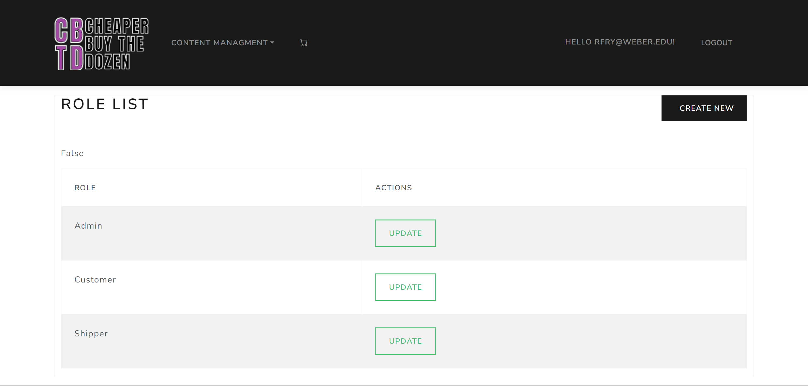

# Developing an Online Store with ASP.NET Core and C#

The purpose of this project was to create an Online Store with <b>ASP.NET Core</b> and <b>C#</b>.

Below is a gif that illustrates dynamic features of the store.

## CHEAPER BUY THE DOZEN (CBTD) - Online Store

CHEAPER BUY THE DOZEN (CBTD) is an online store with a range of features to provide users with a right shopping experience while offering administrators the tools needed to manage the store effectively.

Key Features:

1. Product Catalog: The online store boasts a product catalog, allowing users to browse through a range of items. Products are organized into categories and may be associated with specific manufacturers, making it easier for users to find what they're looking for.

2. Shopping Cart: Users can add products to their shopping cart as they browse the store. The shopping cart keeps track of selected items and their quantities, providing a clear overview of the user's intended purchases.

3. Cart Management: Users have the ability to manage the contents of their shopping cart. This includes updating the quantity of items and removing products.

4. User Authentication: The store incorporates a login system with different permission levels. This ensures that users have an access only the features they are authorized to use.

5. User Roles: User roles help define the permissions and capabilities of each user. For instance, regular customers may have limited access, while admin users enjoy elevated privileges to manage various aspects of the store.

6. Admin Dashboard: Admin users are provided with a dedicated dashboard that grants them control over critical aspects of the online store. They can manage products, categories, manufacturers, user accounts, and user roles with ease.

7. Product Management: Admins have the ability to add, edit, or delete products from the catalog. This includes specifying product details, such as name, description, price, and availability.

8. Category and Manufacturer Management: Admins can create, modify, or remove product categories and manufacturers. This helps maintain an organized and structured product catalog.

9. User Management: Admins have the authority to manage user accounts. This includes adding new users, modifying user information, and deactivating or deleting accounts if necessary.

10. Role Assignment: Admins can assign roles to users, ensuring that individuals have the right permissions based on their responsibilities within the organization.

### Main Page with Products

### Product Details Page

### Products Admin Page

### Create New Product Page

### Categories Admin Page

### User Admin Page

### User Roles Admin Page

### Login Page

